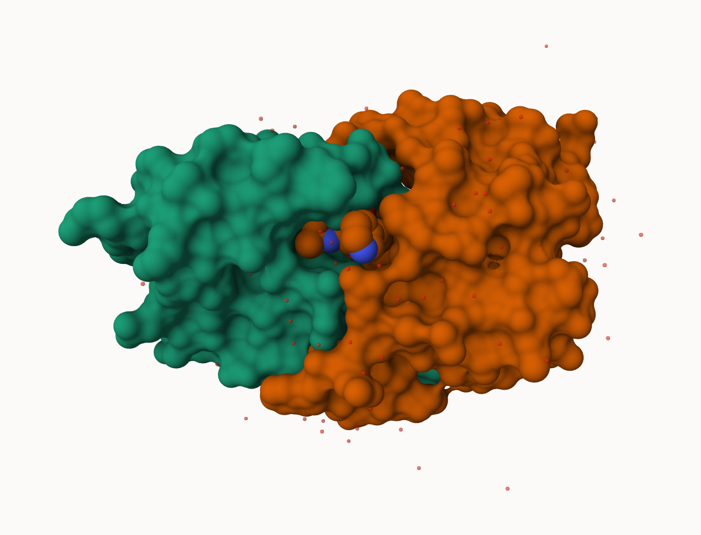
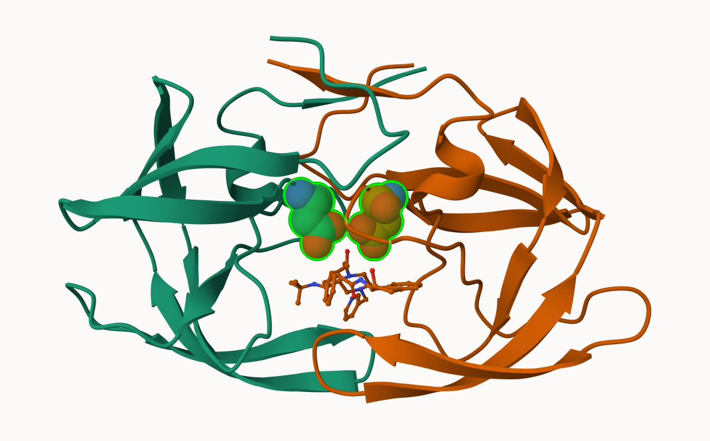
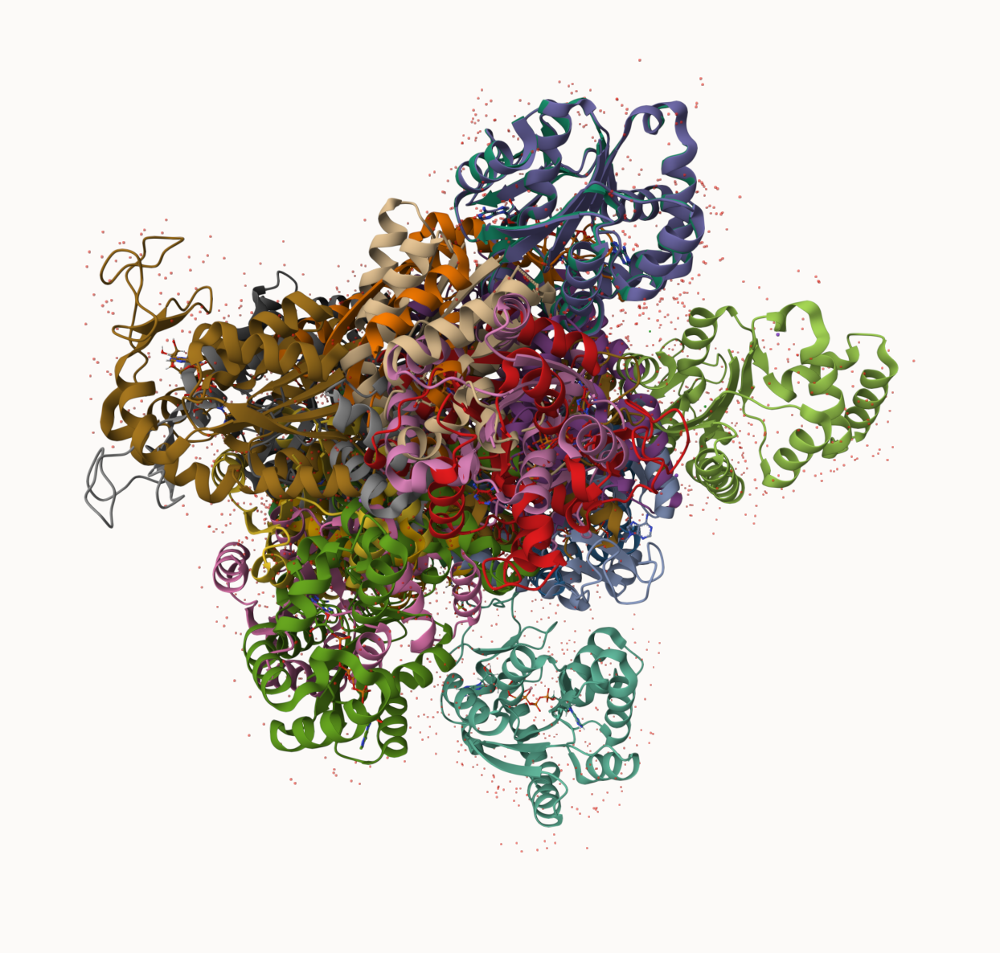

## PDB Statistics

The Protein Data Bank (PDB) is the main repository of biomolecular structures. Let's see what it contains:

```{r}
stats <- read.csv("Data Export Summary.csv")
stats
```
```{r}
stats$X.ray
```

```{r}
sum(stats$Neutron)
```

The comma in these numbers leads to the numbers here being read as characters. 

```{r}
c(100, 10, "barry")
```

```{r}
library(readr)
stats <- read_csv("Data Export Summary.csv")
stats
```


> Q1: What percentage of structures in the PDB are solved by X-Ray and Electron Microscopy? 93.79%

```{r}
sum(c(stats$`X-ray`, stats$`EM`))
sum(stats$Total)
(sum(c(stats$`X-ray`, stats$`EM`)))/sum(stats$Total)

```
```{r}
n.xray <- sum(stats$`X-ray`)
n.em <- sum(stats$`EM`) 
n.total <- sum(stats$Total)
(n.xray + n.em)/n.total
```

> Q2: What proportion of structures in the PDB are protein? 85.97%

```{r}
n.protein <- stats[1, "Total"]
p_protein <- n.protein/n.total
p_protein
```
> Q3. Skip...

## Visualizing the HIV-1 protease structure 

We can use the Molstar viewer online: http://molstar.org/viewer/



> Q4: Water molecules normally have 3 atoms. Why do we see just one atom per water molecule in this structure? X-ray crystallography detects eletron density, not atom directly. Oxygen has many electrons while hydrogen atoms have only one electron. 

> Q5: There is a critical “conserved” water molecule in the binding site. Can you identify this water molecule? What residue number does this water molecule have? HOH 308

A new clean image showing the catalytic ASP25 amino acids in both chains of the HIV-PR dimer along with the inhibitor and all important active site water.



> Q6: Generate and save a figure clearly showing the two distinct chains of HIV-protease along with the ligand. You might also consider showing the catalytic residues ASP 25 in each chain and the critical water (we recommend “Ball & Stick” for these side-chains). Add this figure to your Quarto document.

## Bio3D package for structural bioinformatics 

```{r}
library(bio3d)

pdb <- read.pdb("1hsg")
pdb
```

```{r}
head(pdb$atom)
```

> Q7: How many amino acid residues are there in this pdb object? 198

> Q8: Name one of the two non-protein residues? HOH

> Q9: How many protein chains are in this structure? 2

```{r}
library(bio3dview)
library(NGLVieweR)

# view.pdb(pdb) |> setSpin()
```

```{r}
# Select the important ASP 25 residue
sele <- atom.select(pdb, resno=25)

# and highlight them in spacefill representation

# view.pdb(pdb, cols=c("navy","teal"), highlight = sele,  highlight.style = "spacefill") |>  setRock()
```

## Predicting functional motions of a single structure

Read an ADK structure from the PDB database:

```{r}
adk <- read.pdb("6s36")
adk
```

```{r}
m <- nma(adk)
plot(m)
```

Write out our results as a wee trajectory/movie of predicted motions:

```{r}
# mktrj(m, file="adk_m7.pdb")
```

## Comparative structure analysis of Adenylate Kinase

> Q10. Which of the packages above is found only on BioConductor and not CRAN? msa

> Q11. Which of the above packages is not found on BioConductor or CRAN? bio3dview

> Q12. True or False? Functions from the pak package can be used to install packages from GitHub and BitBucket? True 

> Q13. How many amino acids are in this sequence, i.e. how long is this sequence? 214

## Comparative analysis with PCA

First step find an ADK sequence:

```{r}
library(bio3d)
id <- get.seq("1ake_A") ## Change this to run a different analysis
aa <- get.seq( id )
```
```{r}
aa
```

Next step, is search the PDB database for all related entries:

```{r}
blast <- blast.pdb(aa)
hits <- plot(blast)
```

All the BLAST results are here for us to see: 
```{r}
blast$hit.tbl
```

The "top hits" are in the `hit` object. Now we can download these to our computer. Put these in a wee sub-folder (directory) called "pdbs" and use gzip to speed things up.

```{r}
# Download related PDB files
files <- get.pdb(hits$pdb.id, path="pdbs", split=TRUE, gzip=TRUE)
```

These look like a hot mess 



Next we will use the `pdbaln()` function to align and also optionally fit (i.e. superpose) the identified PDB srtuctures

This requires a BioConductor packaged called "msa" that we need to install.
First we install BiocManager. Then we use `BiocManager::install("msa")

```{r}
# Align related PDBs
library(bio3d)
pdbs <- pdbaln(files, fit = TRUE, exefile="msa")
```

Have a wee peak at this new "alignment object" `pdbs`
```{r}
pdbs
```
We could view this R with **bio3dview** `view.pdbs()` function.
```{r}
view.pdbs(pdb)
```
```{r}
library(bio3dview)
view.pdbs(pdbs, colorScheme = "reside")
```

## PCA

We can run PCA on our `pdbs` object using the `pca()` function from **bio3d**:
```{r}
pc.xray <- pca(pdbs)
plot(pc.xray)
```

```{r}
plot(pc.xray, 1:2)
```

We can make a visualization of the major confirmation difference (i.e. large scale structure change) captured by our PCA analysis with the `mktrj()` function 

```{r}
pc1 <- mktrj(pc.xray, file="pca.pdb")
```

Let's see in Molstar

> What is the total number of entries in the PDB

```{r}
n.sums["Total"]
```

